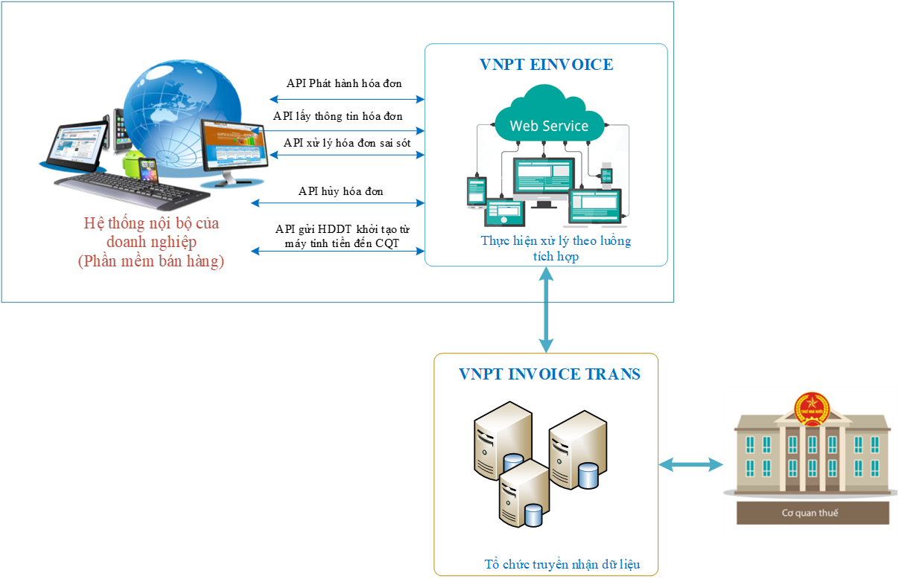

# 1.Mô hình và nghiệp vụ

Dưới đây là sơ đồ mô hình tích hợp Dịch vụ **HDDT MTT** với phần mềm **Bán hàng, MTT**:


## Mô hình tích hợp 

Dưới đây là sơ đồ, mô hình tích hợp HDDT Máy tính tiền với phần mềm bán hàng, máy tính tiền




## Nghiệp vụ HDDT MTT cần tích hợp 

Để đảm bảo đồng bộ dữ liệu, khuyến nghị đối tác tích hợp đủ các nghiệp vụ sau:

```jsx title="Danh sách nghiệp vụ HDDT MTT quan trọng"
1. Nghiệp vụ insert/update khách hàng
2. Nghiệp vụ phát hành hóa đơn
3. Nghiệp vụ lấy thông tin hóa đơn
4. Nghiệp vụ hủy hóa đơn
5. Nghiệp vụ điều chỉnh hóa đơn
```

## ĐẦU VÀO VNPT GỬI
Khi đối tác có nhu cầu tích hợp phần mềm bán hàng, máy tính tiền. Sau khi thống nhất thỏa thuận, đầu mối VNPT sẽ khởi tạo hệ thống demo và gửi cho đối tác những thông tin sau: 

:::tip Link web Cadmin và tài khoản

    vd: https://4200241296-999-tt78democadmin.vnpt-invoice.com.vn
    tài khoản Cadmin là Account: ****** 
    mật khẩu Cadmin là ACPass: ******
    tài khoản này được dùng để đăng nhập web Cadmin để sử dụng các nghiệp vụ hóa đơn điện tử trên web, cũng như là tham số để gọi hàm webserivce. 
:::

:::tip Tài khoản Role Service

    tài khoản Role Service là userName : ****** 
    mật khẩu Role Service là userPass: ******
    tài khoản này được dùng để gọi hàm webserivce. 
:::

:::tip Link websservice

Link Cadmin+/PortalService.asmx

Link Cadmin+/BusinessService.asmx

Link Cadmin+/PublishService.asmx

vd: 

https://4200241296-999-tt78democadmin.vnpt-invoice.com.vn/PortalService.asmx

https://4200241296-999-tt78democadmin.vnpt-invoice.com.vn/BusinessService.asmx

https://4200241296-999-tt78democadmin.vnpt-invoice.com.vn/PublishService.asmx
:::